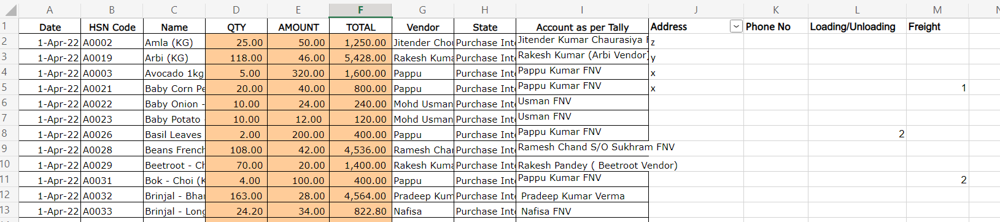
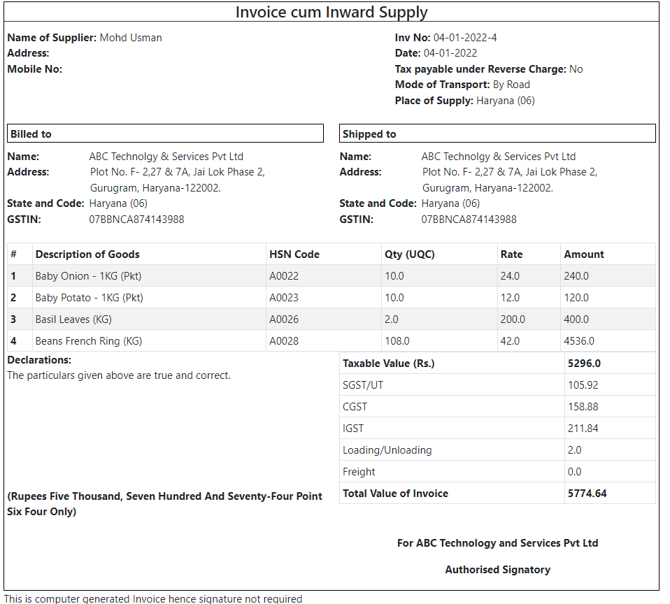
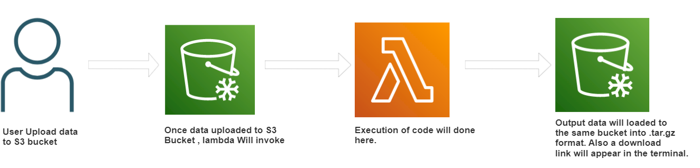

# auto-invoices-generation
## Table of content: 
1. Overview
2. Technology used
3. Installation
4. Local Setup and testing
5. Process flow using AWS services
6. Run using AWS Sam Cli

## 1. Overview:
This project is used to generate the invoices from the excel data.\
Input formats: ".xls or .xlsx"\
Output format: ".tar.gz"

### Input


### Output


## 2.Technology used
### S3 Bucket: 
An Amazon S3 bucket is a public cloud storage resource available in Amazon Web Services' (AWS) Simple Storage Service (S3), an object storage offering. Amazon S3 buckets, which are similar to file folders, store objects, which consist of data and its descriptive metadata.

### Amazon Lambda: 
AWS Lambda is an event-driven, serverless computing platform provided by Amazon as a part of Amazon Web Services. It is a computing service that runs code in response to events and automatically manages the computing resources required by that code.

### AWS CLI:
The AWS Command Line Interface (CLI) is a unified tool to manage your AWS services. With just one tool to download and configure, you can control multiple AWS services from the command line and automate them through scripts.

### AWS SAM CLI:
The AWS Serverless Application Model (SAM) is an open-source framework for building serverless applications. It provides shorthand syntax to express functions, APIs, databases, and event source mappings. With just a few lines per resource, you can define the application you want and model it using YAML.

### Docker:
Docker is an open source containerization platform. It enables developers to package applications into containers—standardized executable components combining application source code with the operating system (OS) libraries and dependencies required to run that code in any environment.

## 3. Installation: 

* AWS CLI - [Install AWS CLI](https://docs.aws.amazon.com/cli/latest/userguide/getting-started-install.html)
* SAM CLI - [Install the SAM CLI](https://docs.aws.amazon.com/serverless-application-model/latest/developerguide/serverless-sam-cli-install.html)
* Docker - [Install Docker community edition](https://hub.docker.com/search/?type=edition&offering=community)

You can check whether you have installed everything by typing the following commands:
```
aws --version
sam --version
python --version
docker --version
```
## 4.Local Setup and testing
Follow these steps to run the application locally and generate invoice on your local system.
```
1. Clone this repository.
2. cd auto-invoice-generation
3. pip install -r requirements.txt
4. Keep input excel file in to the data/input folder
5. Change the values in .env and source the .env file to set the environment variables
6. Open terminal and run 'python run.py <input_filepath>'
7. Check data/output folder to see the invoices
```

### Configure AWS credentials and create bucket using the following command
```
1. aws configure
2. aws s3api create-bucket \
    --bucket <BUCKET NAME> \
    --region <REGION>
```

Change the values of mentioned variables in the event_file.json file
  ```
  "awsRegion": <String:REGION>,
  "bucket":{"name":<String:BUCKET NAME>,}
  "arn": "arn:aws:s3:::<BUCKET NAME>",
  "object": {"key": <String:FILE NAME>,}
  ```
Change the value of mentioned variable in the template.yaml file
  ```
  BucketName: <BUCKET NAME>
  ```
## 5. Process flow using AWS services
- Upload the excel file in the s3 bucket.
- File name should be name as key name in the event_file.json
- Once file get uploaded, Lambda function gets invoked and code gets processed.
- Once the process get completed, invoices gets upload into the s3 bucket as a tar file
- Finally returns an URL of the tar file to download the invoices.



## 6.Testing using AWS Sam Cli
Allows you to run your serverless application locally for quick development and testing. When you run this command in a directory that contains your serverless functions and your AWS SAM template, it creates a local HTTP server that hosts all of your functions.

```
cd auto-invoice-generation
sam build
sam validate
sam local invoke -e ./data/input/event_file.json
```
